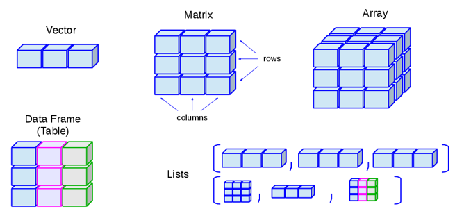

# Grundlagen

## Fundamentale Datentypen in R

In R existieren verschiedene atomare Datentypen aus welchen sich
wiederum komplexere Datentypen konstruieren lassen.

In R existieren verschiedene atomare Datentypen aus welchen sich
wiederum komplexere Datentypen konstruieren lassen.

Datentyp           |  Beschreibung                       | Beispiel 
-------------------|-------------------------------------|----------
integer            |    ganze Zahlen                     |    -2L       
numeric            |   reelle Zahlen                     |    5.2456   
logic              |   logische Werte                    |    TRUE, FALSE     
character          |    Zeichenfolge                     |    'a', "Mexico" 


Textelemente müssen immer in Anführungszeichen stehen, also entweder <font style="font-family:Times New Roman">"..."</font> oder <font style="font-family:monospace">'...'</font>

In R können manche atomare Datentypen besondere Ausprägungen annehmen.

Datentyp           |  Ausprägung       | Bedeutung 
-------------------|-------------------|----------
numeric            |   NaN             | "Not a Number"
numeric            |   Inf             | Unendlich
logic              |   NA              | Unbestimmt    
NULL               |   NULL            | Leer   

### Umformung

Gelegentlich kommt es vor, dass beim Import von Datensätzen die Daten im falschen Format übernommen werden, diese können wieder umgeformt werden 

\vspace*{0.5cm}

character $\rightarrow$ numeric

```{r,comment=""}
as.numeric("2")
```

logical $\rightarrow$ numeric (`FALSE` = 0, `TRUE` = 1)

```{r,comment=""}
as.numeric(TRUE)
```

numeric $\rightarrow$ character 

```{r, comment=""}
as.character(2024)
```

numeric $\rightarrow$ logical (0 = `FALSE`, jede andere Zahl = `TRUE`) 

```{r, comment=""}
as.logical(5)
```

## R als Taschenrechner

### Dezimalstellen und Leerzeichen

- Dezimalzahlen werden in R mit einem Punkt und nicht mit einem Komma angegeben

```{r,error=T,comment=""}
2,5
```
```{r,comment=""}
2.5
```

- Die Anzahl von Leerzeichen zwischen Befehlsbestandteilen ist (mit Ausnahmen) egal

### Mathematische Operatoren

R- Befehl |Bedeutung
----------|-----------
+         |Addition
-         |Subtraktion
*         |Multiplikation
/         |Division
^         |Potenz
sqrt(x)   |Wurzel
log(x, base)  |Logarithmus

**Wichtig**: Klammersetzung und Punkt vor Strich

#### Beispiele

```{r,comment=""}
3+2*8
```
```{r,comment=""}
(2*10)/(2*2.5)
```
```{r,comment=""}
sqrt(2)^2
```
```{r,comment=""}
log(100000, base=10)
```

### Logische Operatoren

R Befehl |Bedeutung
---------|----------
==       |Gleich
>        |Größer
<        |Kleiner
>=       |Größer gleich
<=       |Kleiner gleich
!=       |Nicht-gleich
&        |logisches UND
\|        |logisches ODER

#### Beispiele

```{r,comment=""}
4<5
```
```{r,comment=""}
23!=24
```
```{r,comment=""}
10<=4 | 12==6
```
```{r,comment=""}
!("a"<"b" & TRUE==TRUE)
```

## Variablen und Objekte

### Abspeichern von Variablen

- Werte können in Variablen (Objekten) gespeichert werden

```{r,comment=""}
x <- 5 + 3
```

- Objekte sind nach der Zuweisung mit ihrem Namen abrufbar

```{r,comment=""}
x
```

- Gespeicherte Objekte können weiterverwendet werden

```{r,comment=""}
x <- 5
x + 10
```
```{r,comment=""}
y <- 2 * 3
y + x
```
```{r,comment=""}
z <- y + x
z
```

- Es können alle möglichen Elemente in Objekten gespeichert werden
  - Text:
  
```{r, comment= ""}
z <- "Textelement"
z
```
  
  - logische Werte:
  
```{r,comment=""}
y <- 5 < 4
y
```


### Hinweise zur Benennung

- R unterscheidet Groß- und Kleinschreibung:
  - `X` und `x` sind nicht das Gleiche
- Variablennamen dürfen nur Buchstaben, Zahlen, Unterstrich und Punkt enthalten
- Variablennamen sollten keine Leerzeichen enthalten
- Umlaute und ß wenn möglich vermeiden
- Variablennamen dürfen nicht mit einer Zahl oder einem Unterstrich beginnen

```{r,error=T,comment=""}
7b <- 5+5
```

### Enviroment


- Gespeicherte Objekte sind im Workspace (Environment) mit zusätzlichen Informationen aufgelistet
- Objekte können durch das Kästchen ausgewählt und durch das Besensymbol gelöscht werden

#### Befehle für Zugriff auf Environment:


- `ls()` listet in der R-Konsole den Workspace auf
- Mit `rm("objektname1","objektname2")` werden Objekte entfernt
- Mit `rm(list = ls())` werden alle Objekte entfernt

## Funktionen

**Woraus besteht eine Funktion?**

- R beinhaltet eine große Menge an Grundfunktionen
- Allgemeine Struktur: `Funktion(Argument1, Argument2, …)`
- Die Argumente definieren und spezifizieren die Funktion
- Beispiele für einfache Funktionen (hier nur ein Argument):
  - `sqrt(x)` berechnet Quadratwurzel 
  - `mean(X)` berechnet Mittelwert eines Vektors

### Funktionen mit mehreren Argumenten

- `c(Argument1, Argument2, Argument3)` definiert einen Vektor mit drei Werten (z.B. Spaltennamen)
  
```{r,comment=""}
c(1,2,3,4,5)
```
```{r,comment=""}
c("Hund","Katze","Maus")
```

	  
- `round(x, digits = 2)` rundet x auf 2 Nachkommastellen
```{r,comment=""}
round(3.141593, digits = 2)
```

### Default-Werte in Funktionen

- Nicht alle Argumente von Funktionen müssen angegeben werden
- Diese optionalen Argumente nehmen dann default-Werte ein
- Beispielsweise bei `round()` ist der Default-Wert `digits = 0`
- default-Werte können in R Documentation nachgesehen werden (s. Help-Funktion)

```{r,comment=""}
round(3.141593)
```


- Die Argumente müssen nicht explizit benannt werden

```{r,comment=""}
round(3.141593,2)
```
```{r,comment=""}
round(2,3.141593)
```

- Dann ist aber die Reihenfolge wichtig, in der die Werte der Argumente eingegeben werden
- Benennen ist allerdings nachvollziehbarer (hilft, Fehler zu vermeiden)


### Exkurs: Help-Funktion

- Durch die Funktion `help()` und `?` lässt sich unter anderem herausfinden, welche Funktion welche Argumente benötigt

```{r,comment="",eval=FALSE}
help(round)
```
```{r,comment="",eval=FALSE}
?round
```


### Abspeichern von Output einer Funktionen

- Die Ergebnisse von Funktionen können ebenfalls unter Objekten abgespeichert (und weiterverwendet) werden

```{r,comment=""}
x <- c(1,2,3,4,5)
x
```
```{r,comment=""}
r <- round(3.141593,2)
r+5
```

## Datenstrukturen

**Übersicht**



### Vektoren

- eindimensionale Datenstruktur, in dem mehreren Elemente enthalten sind
- können im Enviroment als Objekt abgespeichert werden
- Mathematische und logische Operatoren können auf den Vektor (auf alle Elemente) angewandt werden

```{r,comment=""}
x <- c(1,2,3,4,5)
x+1
```
```{r,comment=""}
x>3
```

Durch eckige Klammern `[]` können durch Angabe ihrer Position einzelne Elemente eines Vektors ausgewählt (indiziert) werden. 

(**Wichtig**: in R beginnt der Index immer mit 1)

```{r,comment=""}
y <- c(110,120,130,140,150)
y
```
```{r,comment=""}
y[3]
```
```{r,comment=""}
y[c(1,3,5)]
```

Die Elemente können auch aufgrund von gewissen Bedingungen ausgewählt werden

```{r,comment=""}
y <- c(110,120,130,140,150)
y
```
```{r,comment=""}
y[y>=130]
```
```{r,comment=""}
y[y==120]
```

Steht ein negatives Vorzeichen vor dem Index, so wird jedes Element außer dem indizierten aus dem Vektor ausgewählt

```{r,comment=""}
x <- c(1,2,3,4,5)
x
```
```{r,comment=""}
x[-3]
```
```{r,comment=""}
x[c(-1,-3)]
```

Soll eine gewisse Reihe von angrenzenden Elementen (von Element `i` bis Element `j`) vektorisiert werden, werden die Indizes mit `:` verbunden (also `i:j`).

```{r,comment=""}
x <- c(1:5)
x
```
```{r,comment=""}
x[1:3]
```

### Matrizen

- Zweidimensionale Datenstruktur
- Matrizen werden in R mit `matrix(data = …, nrow = …, ncol = …, byrow = …)` erstellt
  - `data` ist ein Vektor, der die Elemente der Matrix enthält
  - `nrow` definiert die Anzahl der Zeilen der Matrix
  - `ncol` definiert die Anzahl der Spalten der Matrix
  - Wird die Matrix zeilenweise (`byrow = TRUE`) oder spaltenweise (`byrow = FALSE`) mit den Elementen befüllt?


```{r,comment=""}
d <- c(1:9)
m <- matrix(data = d, nrow = 3, ncol = 3, byrow = TRUE)
m
```

Die Auswahl von Matrixelementen ist analog zu der Auswahl von Elementen aus einem Vektor

- Allerdings wird bei einer Matrix ein Element durch zwei Positionen (Zeile und Spalte) definiert
  
```{r,comment=""}
m
```
```{r,comment=""}
m[3,2]
```

- Sollen alle Spalten in einer bestimmten Zeile ausgewählt werden, bleibt der Spaltenindex leer
- Analog für die Auswahl aller Zeilen in einer bestimmten Spalte
- Negative Indizierung und Mehrfachauswahl auch möglich

```{r,comment=""}
m
```
```{r,comment=""}
m[3,]
```
```{r,comment=""}
m[,2]
```

### Dataframes

- Ein Dataframe ist eine Datenstruktur ähnlich zur Matrix 
- jede Spalte beinhaltet Werte einer Variable und jede Reihe Werte von jeder Variable (Spalten müssen gleichlang sein)
- Data Frames können mit `data.frame()` aus mehreren (gleichlangen) Vektoren erstellt werden

```{r,comment=""}
alter <- c(16,17,15,22)
geschlecht <- c("w","w","m","m")
dataframe <- data.frame(alter, geschlecht)
dataframe
```

Verschieden Möglichkeiten für Elementauswahl

- Zeilen- und Spaltennummer (analog zu Matrizen)

```{r,comment=""}
dataframe[2,1]
```

- oder mithilfe des **\$}** operators direkt auf Variablen zugreifen

```{r,comment=""}
dataframe$alter
```
```{r,comment=""}
dataframe$alter[2]
```

- Mit dem `\$` Operator können zudem einzelne Werte verändert werden

```{r,comment=""}
dataframe$geschlecht[2] <- "m"
```

- ... oder ganze Variablen gelöscht werden

```{r,comment=""}
dataframe$geschlecht <- NULL
```


** Um festzustellen, ob die Veränderungen funktioniert haben, muss nicht immer das Objekt extra in der Konsole aufgerufen werden. Es reicht im Enviroment zu schauen ob sich das Objekt entsprechend verändert hat.**

- Desweiteren können auch neue Variablen hinzugefügt werden

```{r,comment=""}
dataframe$aktuellesJahr <- rep(2022, times = 4)
```

- ...oder aus bestehenden Variablen gebildet werden

```{r,comment=""}
dataframe$geburtsjahr <- dataframe$aktuellesJahr - dataframe$alter
dataframe
```

## Packages

- R besteht aus einer Reihe von vorinstallierten Grundfunktionen
- Zusätzliche Funktionen erhält man durch externe Pakete (packages)
- Diese müssen heruntergeladen und eingebunden werden


### Installieren von Packages

- `library()`: Auflistung aller bereits installierten Pakete
- `install.packages("NameDesPakets")`^[**!Hier unbedingt in Anführungszeichen**]: Paket installieren (einmalig), Internetverbindung benötigt
- `library(NameDesPakets)`: Laden eines Pakets (in jeder R-Sitzung nötig)

