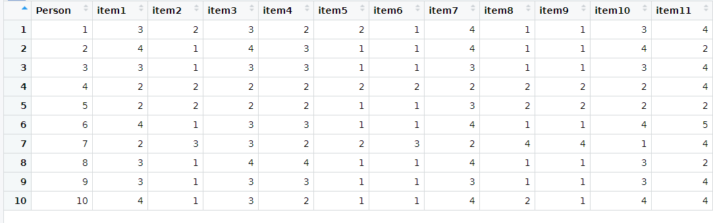

# Datenmanagement I

## Daten importieren

### Organisation von Dateien

- Empfehlung: Einen Ordner für alle Datendateien innerhalb des Projektordners (bspw. data)


### Exkurs: Dateipfade

Beispiel für den *absoluten* Pfad der Datei `Daten.txt` - lässt sich aus den Eigenschaften einer Datei entnehmen.

`D:\\Dokumente\\Kurse\\Rintensiv\\Projektordner\\data\\Daten.txt`

- Wenn nur vom Projektordner aus navigiert werden muss, dann entfällt bei der Pfadangabe der ganze Teil vor *data* (relative Pfadangabe)

**Wichtig**: R nutzt Backslash "\\" zu anderen Zwecken, daher muss ein normaler Slash "/" genutzt werden

Die *relative* Pfadangabe für `Daten.txt` würde also so aussehen:

`data/Daten.txt`

### Daten aus .txt, .csv, .xlsx und weiteren Dateiformaten auslesen

```{r,error=TRUE,comment=""}
dataset <- read.table(file = "data/Daten.txt", header = TRUE)
```

- Dateipfad unter `file =` immer in `""` angeben 
- Navigieren innerhalb des Projektordners (Vorteil: keine vollständigen Dateipfade müssen angegeben werden)

- `header` (default: `FALSE`): nimmt die erste Zeile als Variablennamen
- `sep` (default: `""`): legt fest wie die Spalten in der Ursprungsdatei getrennt sind
- `dec` (default: `"."`): legt fest welches Zeichen zur Dezimaltrennung genutzt wird

**Befehl für .csv Dateien**

```{r,eval=FALSE,comment=""}
dataset <- read.csv2("data/Daten.csv")
```

**Befehl für .xlsx Dateien**

```{r, eval=FALSE,comment=""}
install.packages("xlsx")
library(xlsx)
dataset <- read.xlsx("data/Daten.xlsx")
```

**Befehl für .sav Dateien (SPSS)**

```{r, eval=FALSE,comment=""}
install.packages("haven")
library(haven)
dataset <- read_sav("data/Daten.sav")
```

### Alternative per Klickpfad

Im Environment auf *Import Dataset* klicken und gewünschtes Format auswählen:


Anschließend gewünschtes Dataset suchen und anklicken.

Vorschau mit allen Argumenten, die auch im **read.table()** enthalten sind:


Eingabe in die Konsole:

```{r,eval=FALSE,comment=""}
Daten_2 <- read.csv("data/Daten_2.txt", 
                    sep="")
View(Daten_2)
```

**Vorteil**: 

- automatisch richtiger Befehl
- Vorschau

**Nachteil**

- Kompletter Dateipfad angegeben, nicht brauchbar für andere 

### Überblick verschaffen

- `str()` gibt die Struktur des Dataframes aus 

```{r,comment=""}
str(dataset)
```

- `dim()` gibt die Dimensionen (Zeilen und Spalten) einer Matrix bzw. Dataframes an
```{r}
dim(dataset)
```


- mit `head()` lassen sich die ersten `n =` `c(Zeilen, Spalten)` anzeigen

```{r,comment=""}
head(x = dataset, n = c(2,11))
```

**View(Dataset)** öffnet eine Ansicht ähnlich zu Excel (View groß geschrieben!)




`names()` gibt die Variablennamen des Datensatzes aus

```{r,comment=""}
names(dataset)
```

Damit lassen sich auch Namen von Variablen im Datenesatz verändern

```{r,comment=""}
names(dataset)[names(dataset) == "item11"] <- "item12"
names(dataset)
```

## Daten speichern

### Datensatz exportieren als .txt, .csv, .xlsx oder .sav

- Befehl: 
  - `write.table(x = data, file = "data/Daten.txt", row.names = FALSE)`
- Argumente:
  - `x`: Welches Objekt soll exportiert werden
  - `file`: Pfad und Name der neuen Datei (.txt am ende nicht Vergessen!)
  - `sep, dec`: Wie bei `read.table`
  - `row.names` (default: `TRUE`): Zeilennamen/ -nummerierung als eigene Spalte
  - `col.names` (default: `TRUE`): Variablennamen als erste Zeile speichern

Genauso wie bei den `read`- Funktionen gibt es auch 

- `write.csv()` für .csv Dateien
- `write.xlsx()` für .xlsx Dateien (Package "`xlsx`" benötigt)
- `write_sav()` für .sav Dateien (Package "`haven`" benötigt)

**Wenn beispielsweise:** file = "Unterordner/exportierteDatei.txt", dann liegt die Datei im Unterodner. Wenn kein Pfad angegeben wird, dann liegt sie im Projektordner.


## Datensätze zusammenfügen

### Fälle hinzufügen

- Situation: Es wurde eine weitere Erhebung mit anderen Personen durchgeführt, in der die gleichen Items abgefragt wurden 

```{r,comment=""}
dataset1 <- read.table("data/Daten.txt", header = TRUE)
head(dataset1,2)
```

```{r,comment=""}
dataset2 <- read.table("data/Daten_2.txt", header = TRUE)
head(dataset2,2)
```

- mit `rbind()` lassen sich Daten (Vektoren, Matrizen, Dataframes) zeilenweise (reihenweise) zusammenfügen (rbind = rowbind)
- es können beliebig viele Datensätze in diesem Befehl zusammengefügt werden
```{r,comment=""}
new_dataset <- rbind(dataset1,dataset2)
```
- Überprüfung
```{r,comment=""}
dim(new_dataset)
```

**Bedingungen**

- Die Datasets haben die gleiche Anzahl an Spalten
- Die Datasets haben die gleichen Namen für die Variablen

### Variablen hinzufügen

**Situation**: Innerhalb der Erhebung gab es noch eine Abfrage von weiteren Items
 

```{r,comment=""}
dataset1 <- read.table("data/Daten.txt", header = TRUE)
head(dataset1,2)
```

```{r,comment=""}
dataset3 <- read.table("data/Daten_FB2.txt", header= TRUE)
head(dataset3,2)
```

- Mit `cbind()` lassen sich Daten (Vektoren, Matrizen, Dataframes) spaltenweise zusammenfügen

```{r,comment=""}
new_dataset2 <- cbind(dataset1, dataset3)
```

- Überprüfung
```{r,comment=""}
dim(new_dataset2)
```

*Bedingung* 
- Datensätze müssen gleiche Anzahl an Zeilen haben
- Datensätze müssen gleich sortiert sein

**Situation**: Innerhalb der Erhebung gab es noch eine Abfrage von weiteren Items, allerdings fehlt eine Person $\rightarrow$ `cbind()` führt nicht zum gewünschten Ergebnis 

```{r,comment=""}
dataset1 <- read.table("data/Daten.txt", header = TRUE)
head(dataset1,2)
```

```{r,comment=""}
dataset4 <- read.table("data/Daten_FB2_NA.txt", header= TRUE)
head(dataset4,2)
``` 

- Mit `merge(…, …, by="...“)` lassen sich Daten (Vektoren, Matrizen, Dataframes) spaltenweise besser zusammenfügen
- Anhand einer Schlüsselvariablen (`by`) können zusammengehörige Fälle erkannt werden
  - `by`: Welche Variable ist die Schlüsselvariable?
  - `by.x`, `by.y`: wie by, aber separate Angabe pro Datensatz, z.B. wenn sie nicht gleich benannt ist 
  - `all`: Alle Fälle behalten (TRUE) oder nur die in beiden Datensätzen vorhandenen (FALSE)
  - `all.x`, `all.y`: wie all, aber nur für einen der Datensätze
  - `sort`: Neu nach Schlüsselvariable sortieren? (TRUE = ja)
  
```{r,comment=""}
new_dataset3 <- merge(dataset1, dataset4, by = "Person", all = FALSE)
head(new_dataset3,2)
```

$\rightarrow$ Person 2 wird raus-gefiltert für alle restlichen Personen werden die neuen Variablen übernommen

- `all = FALSE`: Nur die Fälle werden behalten, die in beiden Datensätzen vorhanden sind

```{r,comment=""}
new_dataset3 <- merge(dataset1, dataset4, by = "Person", all = TRUE)
head(new_dataset3,2)
```

$\rightarrow$ Person 2 bleibt erhalten. Die nicht vorhandenen VAriablen werden mit NA gefüllt
