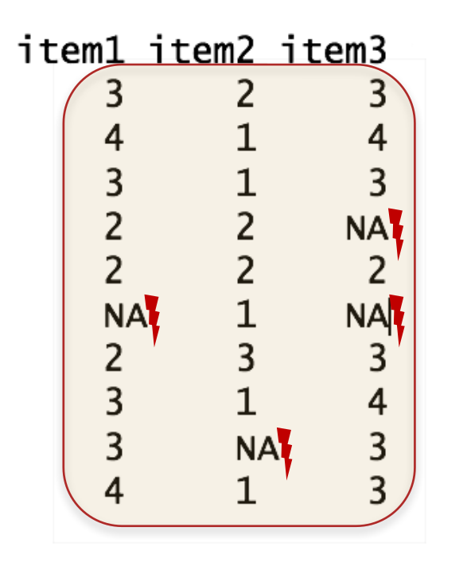
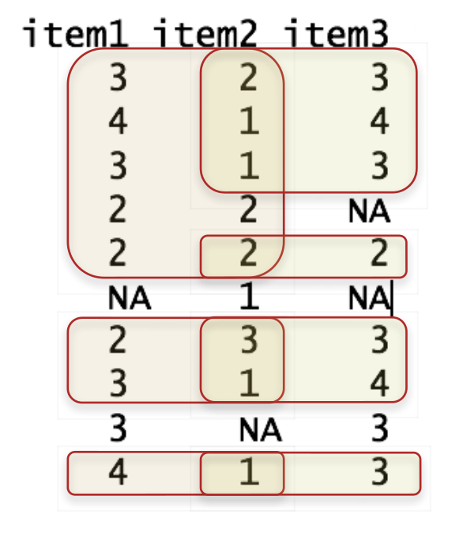
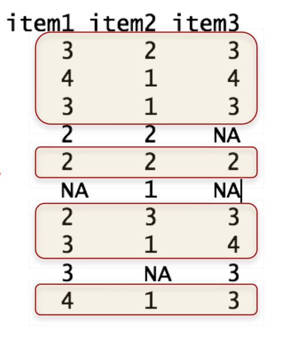

# Korrelation und Regression 

## Kovarianz und Korrelation

**Beispieldatasatz**

Wie hängen die Itemantworten zusammen?

```{r, comment=""}
# Beispieldatasatz einlesen
df_exam <- read.table("data/Daten.txt", header = TRUE)

# Ersten 5 Zeilen und 8 Spalten anzeigen
head(df_exam, c(5,8))
```

**Zwei Variablen**

- Für die Berechnung der Korrelation wird **cor()** verwendet, für die Berechnung der Kovarianz **cov()**    
- Argumente bei **cor(x, y, method = "…", use = "…")**
  - **x** und **y**: datavektoren  
  - **method**: Welche Korrelation soll berechnet werden?   
    - Produkt-Moment-Korrelation (**"pearson"**), Rangkorrelation &rho; (**"spearman"**) oder Rangkorrelation &tau; (**"kendall"**)
  - **use**: Umgang mit fehlenden Werten (siehe nächste Folie)

**Fehlende Werte**

- **Use = "…"** regelt den Umgang der Korrelationsfunktionen mit fehlenden Werten
  - **"everything"**: Kein Umgang mit fehlenden Werten &rarr; bei einzelnen fehlenden Werten wird keine (einzige) Korrelation berechnet                (Ergebnis: **NA**) 
  - **"pairwise"**: Korrelationen werden jeweils mit den vollständigen Fällen pro Variablenpaar berechnet (paarweiser Ausschluss)
  - **"complete"**: Korrelationen werden nur aus in allen Variablen vollständigen Fällen berechnet (fallweiser Ausschluss) 

everything|  pairwise  |  complete 
----------|------------|--------------
{height=150px} | {height=150px}| {height=150px}

**Funktion cor.test()**

- **cor.test(x, y, method = "…", use = "…", alternative = "…", conf.level =     …, …)** für **Inferenzstatistik** bei **Korrelationen**.
  - **x, y, method, use**: Siehe **cor()**
  - **alternative**: Ist die Testrichtung… 
    - Ungerichtet (default): **"two.sided"**
    - einseitig: Positive Korrelationshypothese **"greater"**
    - einseitig: Negative Korrelationshypothese **"less"**
  - **conf.level**: Konfidenzniveau (1 - &alpha;)
    - **default**: 0.95
	
**Beispiel**

```{r, comment=""}
# Korrelation item1, item2
cor(df_exam$item1, df_exam$item2, method = "pearson")

# Produkt-Moment-Korrelation, Hypothese: negativ ,alpha = 1%
cor.test(df_exam$item1, df_exam$item2, method = "pearson",
         alternative = "less", conf.level = .99)
```

## Matrizen

Werden Dataframes (oder Teile dessen) in **cov()** oder **cor()** eingefügt, werden Kovarianz- und Korrelationsmatrizen ausgegeben:

```{r, comment=""}
cov(df_exam[, 2:4])

cor(df_exam[, c("item1", "item2", "item3")], method = "pearson")
```

- **corr.test()** (Paket **psych**) liefert inferenzstatistische Berechnungen auch  für Korrelationsmatrizen
- **corr.test(df, method = "…", adjust = "…", alpha = "…")**
  - **df, method**: Siehe **cor()**, Kendall &tau; kann aber nicht verwendet werden
  - **adjust**: Methode zur &alpha;-Fehler-Adjustierung
    - **"none", "bonferroni", … **
    - Für weitere siehe **?p.adjust** und **?corr.test**
  - **alpha**: Signifikanzniveau &alpha;     
    
```{r, comment=""}
library(psych)
corr.test(df_exam[ ,2:4], method = "pearson", adjust = "bonferroni")
```

**Extraktion von Werten**

- Mit $ können Werte aus der Berechnung extrahiert werden
- Dafür Korrelationsmatrix als Objekt speichern
  - $se für Extraktion der Standardfehler
  - $ci für Extraktion der Konfidenzintervalle
  - $p für Extraktion der p-Werte
  - $t für Extraktion der t-Werte

**Beispiel**

```{r, comment=""}
# Definition eines Objekts mit Inferenzstatistik für df_exam
KorMat <- corr.test(df_exam[ ,2:4], method = "pearson", adjust = "bonferroni")
# Ausgabe Standardfehler
KorMat$se
# Ausgabe Konfidenzintervalle
KorMat$ci
# Ausgabe p-Werte
KorMat$p
```

## (Multiple) lineare Regression

**Wiederholung:**

- Ziel: Ein Kriterium (abhängige Variable) durch die Kombination von Prädiktoren (unabhängige Variablen) vorhersagen

- Signifikanztests für
    - einzelne Prädiktoren
    - das Gesamtmodell
    - Modellvergleiche

### Modelldefinition

- Um eine Regression in R zu rechnen, muss man anhand der vorliegenden Variablen ein Regressionsmodell spezifizieren
- Regressionsmodelle werden in sogenannten Formel-Objekten definiert
  - Struktur: Abhängige Variable(n) ~ Unabhängige Variable + Unabhängige Variable + …
  - Mehrere Variablen werden mit + verbunden
- Variablenbezeichnungen entsprechend anpassen
  - item1 soll durch item2 und item3 vorhergesagt werden


```{r, eval=FALSE}
# Beispiel Modelldefinition
model1 <- item1 ~ item2 + item3
```
	
### Modellschätzung

- Anhand des definierten Regressionsmodells und der vorhandenen Daten kann R nun die Modellparameter (inkl. Modellpassung) schätzen
- Lineare Regressionsmodelle werden mit **lm(formula = …, data = …)** geschätzt:
  - **formula**: Definiert das Modell
  - **data**: dataframe, der die Variablen enthält
- **lm()** sollte für die weiteren Berechnungen als Objekt gesichert werden

**Beispiel Modellschätzung**

```{r, comment=""}
# Modelldefinition
model1 <- item1 ~ item2 + item3

# Modellschätzung und Sicherung in fit1
fit1 <- lm(formula = model1, data = df_exam)

# Alternativ
fit1 <- lm(formula = item1 ~ item2 + item3, data = df_exam)

# Modell anzeigen
fit1
```

- Mit **summary()** lassen sich detaillierte Informationen zum Regressionsmodell ausgeben:


```{r, comment=""}
# Ausgabe Informationen Regressionsmodell, fit1
summary(fit1)
```


### Modellvergleich

- Zwei genestete Modelle können mit **anova(fit1, fit2)** miteinander verglichen werden
  - **fit1**: Ausgangsmodell (restringiertes Modell)
  - **fit2**: Erweitertes Modell (mit zusätzlichen Prädiktoren)

```{r, comment=""}
# Modelldefinition, model1 + model2
model1 <- item1 ~ item2 + item3
model2 <- item1 ~ item2 + item3 + item4

# Modellschätzung, fit1 + fit2
fit1 <- lm(model1, df_exam)
fit2 <- lm(model2, df_exam)
```

**Beispiel Modellvergleich**

```{r, comment=""}
# Modellvergleich, fit1 + fit2
anova(fit1, fit2)
```

## Ergänzungen

### Matrizen

- Kovarianzmatrizen werden mit **cov2cor()** in Korrelationsmatrizen umgewandelt:

```{r, comment=""}
# Zuweisung
Kova <- cov(df_exam[ , 2:4])
# Berechnung
cov2cor(Kova)
# Alternativ
cor(df_exam[ , 2:4])
```

### Weitere Korrelationen

- Mit dem Paket **psych** können zudem
  - Partialkorrelationen (**partial.r()**),
  - tetrachorische (**tetrachoric()**),
  - polychorische (**polychoric()**),
  - biserale (**biserial()**) 
  - und polyseriale (**polyserial()**) Korrelationen berechnet werden
- Mit dem Paket **ppcor** können Semipartialkorrelationen berechnet werden

### Standartisierte und unstandartisierte Regressionkoeffizienten

- Mit **coefficients()** oder **$coefficients** lassen sich die nicht-standardisierten Regressionskoeffizienten ausgeben
- Mit **lm.beta()** aus dem Paket **QuantPsyc** lassen sich standardisierte Regressionskoeffizienten ausgeben


```{r, comment=""}
# Unstandartisierte Regressionskoeffizienten
coefficients(fit1)

# Ausgabe
fit1$coefficients

# Standartisierte Regressionskoeffizienten
QuantPsyc::lm.beta(fit1)
```

### Vorhergesagte Werte

- **predict()**, **fitted.values()** oder **\$fitted.values** gibt die vorhergesagten Werte für jeden Datenpunkt als Vektor aus:


```{r, comment=""}
# Vorhersage Werte, fit1
predict(fit1)

# Alternative 1
fitted.values(fit1)

# Alternative 2
fit1$fitted.values
```

### Residuen

- **resid()**, **residuals()** oder **\$residuals** gibt die unstandardisierten Residuen pro datapunkt aus
- **rstandard()** gibt die standardisierten Residuen aus

```{r, comment=""}
# Residuen, fit1
fit1$residuals
```

### Modelldefinition

- Spezielle Modelle:
  - Modell ohne Prädiktoren (Nullmodell): AV ~ 1
  - Modell ohne Intercept (Konstante): AV ~ 0 + UV1 + …
  - Interaktionsterme (Moderation):
    - AV ~ UV1 + UV2 + UV1*UV2
    - Statt "$*$" kann auch "$:$" verwendet werden


### Hinweise zu weiteren Regressionsmodellen in R

- Literatur:
  - Fox, J., & Weisberg, S. (2011). An R companion to applied regression.     London: SAGE. 
  - James, G., Witten, D., Hastie, T., & Tibshirani, R. (2013). An introduction to statistical learning: With applications in R. Springer     texts in statistics. New York: Springer.
- In R sind viele weitere Verfahren zur Modellselektion, -schätzung und -bewertung umgesetzt wie etwa:
  - Bootstrapping
  - Kreuzvalidierung
  - Shrinkage (Lasse/Ridge) Regression
  - Robust Regression
  - Power Analyse

### General Linear Model (GLM)

**glm(forumla, family, data)**

- Generalisierte lineare Modelle als Verallgemeinerung des linearen Modells $\rightarrow$ Breite Einsatzmöglichkeiten
  - **formula**: Wie bei **lm()**
  - **data**: Wie bei **lm()**
  - **family:** Definiert die Zufallsverteilung von Y und die Linkfunktion
- Beispiele:
  - GLM mit Normalverteilung und ohne besondere Linkfunktion (**familiy = gaussian(link = "identity")**)
    $\rightarrow$ Entspricht **lm()**
  - GLM mit Binomialverteilung und logistischer Linkfunktion (**family = binomial(link = "logit")**)
       $\rightarrow$ Binär-logistische Regression

### Mediation und SEM

- Paket **lavaan**
  - Ständig weiterentwickeltes Paket zur Schätzung von Pfad- und              Strukturgleichungsmodellen in R
  - Ermöglicht auch Bootstrapping-Konfidenzintervalle für indirekte           Effekte
  - Ausführliche Dokumentation mit Beispielcodes: 
    - http://lavaan.ugent.be/tutorial/est.html

### Linear Mixed Model (LMM)

- Paket **lme4**
  - Liefert eine breite und gut erprobte Palette an Werkzeugen für            linear mixed models (Hierarchische lineare Modelle; Mehrebenenmodelle)
  - Siehe: Bates, D., Mächler, M., Bolker, B., & Walker, S. (2015).           Fitting Linear Mixed-Effects Models Using lme4. Journal of Statistical     Software, 67(1).
- Paket **lmerTest**
  - Reicht Signifikanztests nach, die in lme4 standardmäßig nicht implementiert sind
  - https://cran.r-project.org/web/packages/lmerTest/index.html
