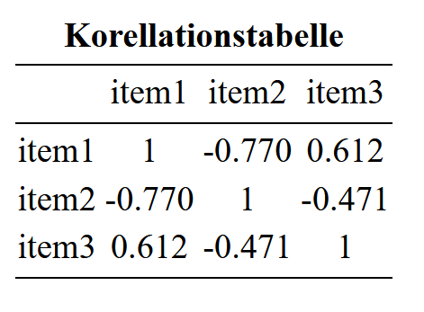
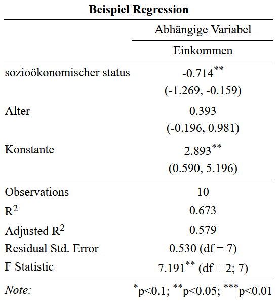

```{r, include=FALSE}
knitr::opts_chunk$set(echo = TRUE, cache = FALSE, warning = FALSE, message = FALSE)

library(tidyverse)
library(haven)
library(hrbrthemes)
library(ggplot2)
library(ggthemes)
```

# Grafiken

## Allgemeines

**Grafiksysteme**

Mit R lassen sich Graphiken auf ganz unterschiedliche Weise erzeugen:

  1. Mit dem vorinstallierten Graphiksystem (base R) lassen sich schnell und unkompliziert vollständige (High-Level) Graphiken erzeugen. 
  2. Mit dem vorinstallierten Graphiksystem (base R) lassen sich jedoch auch (Low-Level)
  Graphiken von Grund auf aufbauen und können sehr individuell gestaltet werden.
  3. Mit verschiedenen Packages lassen sich mit vertretbarem Aufwand ansprechende
  und beliebig komplexe (Medium-Level) Graphiken erstellen. Hierunter zählt v.a.
  `ggplot2` aus dem `tidyverse`.

**Grundfunktionen in base R**

Grafiktyp 	    | 	Base R Funktion
----------------|-------------------
(Datentyp abhängig) | plot()
Balkendiagramm  | 	barplot()
Histogram 	    | 	hist()
Boxplot 	      |	  boxplot()
Kreisdiagramm   |   pie()

**Argumente Grundfunktion in base R**

Fast alle Grafiken können mit folgenden Argumenten näher definiert werden:

- `main = "…"`: Überschrift
- `col = "…"`: Farbe; Mehrere Farben mit `c("…", "…", …)` eingeben
- `xlab = "…"`: Titel der x-Achse
- `ylab = "…"`: Titel der y-Achse
- `xlim = c(…, …)`: Achsenlimits x-Achse
- `ylim = c(…, …)`: Achsenlimits y-Achse
…

**Farben**

Farben können als:

- Farbname ("red"), siehe die Datei Farben in R (im moodle-Kurs)    
- HEX-Code ("#FF8000FF"),
- oder RGB-Code ("229, 245, 249") 

eingetragen werden.


## Grafiken für univariate Verteilungen

### Kreisdiagramme

Kreisdiagramme mit `pie()` erstellen 

- Datenformat: Variable in Häufigkeitstabelle (`table()`)

### Balkendiagramme

Balkendiagramme mit `barplot()` erstellen

- Datenformat: Variable in Häufigkeitstabelle (`table()`)

```{r,echo=FALSE}
data <- read.table("data/YogaPilates.txt",header=T)

```

```{r, out.with= "45%", out.height="45%", fig.align= "center",comment=""}
tab <- table(data$gruppe)
barplot(tab)
```

Mit einigen zusätzlichen Optionen:

\small

```{r, out.width= "53%",out.height="47%", fig.align="center",comment=""}
barplot(tab, 
        main = "Absolute Häufigkeiten der Gruppen", 
        col = c("coral2", "darkcyan", "goldenrod3"), 
        names.arg = c("Kontrollgruppe", "Pilates", "Yoga"), 
        ylab = "Absolute Häufigkeit", 
        ylim = c(0, 50))
```


**Beschriften der Balken**

Es gibt auch die Möglichkeit die jeweiligen Häufigkeiten über den einzelnen Balken abzutragen mit dem Befehl `text(x,y,labels)` können diese Labels eingefügt werden 

- `x`: die x Koordinaten der Labels, hier den bereits erstellten Barplot
- `y`: die y Koordinaten der Labels, da diese dem table entnommen werden kann hier das erstellte table genommen werden. Es muss allerdings noch ein gewisser Wert aufgrechnet werden, damit die Zahlen über den Balken stehen
- `labels`: die eigentlichen Inhalte der Labels. Hier wird auch das table angegeben


\small
```{r, out.width= "53%",out.height="47%", fig.align="center",comment=""}
bar<- barplot(tab, 
        main = "Absolute Häufigkeiten der Gruppen", 
        col = c("coral2", "darkcyan", "goldenrod3"), 
        names.arg = c("Kontrollgruppe", "Pilates", "Yoga"), 
        ylab = "Absolute Häufigkeit", 
        ylim = c(0, 50))
text(x = bar, y = tab+2, labels = tab)
```

### Histogramme

`hist(x, breaks, freq, …)` zeigt die Verteilung einer Variablen in einem **Histogramm**. 

  - `x`: Variable, für die das Histrogramm erzeugt werden soll (wird mit dem `$`-Operator ausgewählt)
  - `breaks`: Wie viele Balken sollen gebildet werden?
    - Keine Angabe: Automatische Auswahl
    - Einzelne Zahl n: Daten werden in n Balken geteilt
    - Vektor: Balken werden zwischen den angegebenen Stellen gebildet 
      - z.B. `breaks = c(0,1,2,3)` $\rightarrow$ 3 Balken: 0 bis 1, 1 bis 2 und 2 bis 3
      - z.B. `breaks = seq(0,100,20)` $\rightarrow$ erstellt Werte im Schritt von 20 im Bereich
      zwischen 0 und 100 (5 Balken)
  - `freq`: Soll statt der absoluten die relative Häufigkeit geplottet werden? (`TRUE` = ja)


```{r,out.width="90%",out.height="75%",comment=""}
hist(data$alter)
```


Mit einigen zusätzlichen Optionen:
```{r,out.width="60%",out.height="60%",fig.align="center",comment=""}
hist(data$alter, main = "Histogramm von Alter", 
     col = "darkolivegreen3", xlab = "Alter",
     ylab = "Häufigkeit", ylim = c(0, 20))

```

### Boxplot

`boxplot(x, range =, …)` erstellt einen bzw. mehrere Boxplots

  - `x`: kann Vektor, Dataframe oder Formel sein
    - Bei Eingabe eines Dataframes werden Boxplots für alle enthaltenen Variablen erzeugt
    - Formeln ermöglichen Trennung nach Gruppen (s.u.)
  - `range`: Definiert die maximale Länge des Whiskers 
    - Werte außerhalb werden als Ausreißer dargestellt
    - z.B.: `range = 2` (2 * Interquatilabstand bzw. Boxlänge)
    - default: `range = 1.5`
  - `...`: Weitere Graphikparameter


```{r,out.width="70%",out.height="65%", fig.align='center',comment=""}
boxplot(data$zufri, 
        col = "darksalmon",
        main = "Boxplot der Zufriedenheitswerte",
        ylab = "Zufriedenheitswert",
        ylim = c(0, 6))

```


## Grafiken für bivariate Verteilungen

### Verteilung einer metrischen auf eine kategoriale Variabel

Mithilfe von Boxplots lässt sich auch die Verteilung einer kategorialen Variable auf eine metrische Variable

`boxplot(A ~ B + C + …)` erzeugt Boxplots für alle möglichen Kombinationen von Faktorstufen getrennt

- `A`: metrische abhängige Variable
- `B + C`: Kategoriale Variablen nach deren Ausprägungen aufgeschlüsselt wird 


```{r,out.width="60%",out.height="55%", fig.align='center',comment=""}
boxplot(data$angst ~ data$gruppe,
        col = "deeppink",
        main = "Boxplots der Angstwerte nach Gruppen getrennt",
        ylab = "Angstwerte", xlab = "",
        ylim = c(0, 6),
        names = c("Kontrollgruppe", "Pilates", "Yoga"))

```

### Verteilung zweier metrischer Variablen

Für zwei metrische Variablen wird meistens die Darstellungsform des **Streudiagramms** gewählt, was mit dem Befehl `plot(x,y,...)` erstellt werden kann.

  - `x`: Erste Variable ()
  - `y`: Zweite Variable
  - `...`: Weitere Graphikparameter (z.B. `pch`: Punkttyp $\rightarrow$ `?pch`)

```{r,echo=F}
dataset <- read.table("data/Daten.txt",header = TRUE)
```

```{r,out.width="60%",out.height="60%",fig.align='center',comment=""}
plot(dataset$item1, dataset$item2,
     ylab = "item1", xlab = "item2", 
     main = "Streudiagramm von Item 1 und Item 2", 
     xlim = c(0, 6), ylim = c(0, 6), pch = 18, col = "firebrick4")

```


Der Befehl `abline()` wird (separat) im Anschluss von `plot()` ausgeführt

Mit `abline(h = ..., v = ... , lwd = ..., lty = ...)` können horizontale (h) bzw. vertikale (v) Linien an beliebiger Position eingefügt werden

  - `h`/`v`: Wert durch welchen die Linie verlaufen soll 
  - `lwd`: legt die Stärke (Dicke) der Geraden fest (`default = 1`)
  - `lty`: legt den Linientyp fest (s. `?par`)


```{r, eval=FALSE,comment=""}
plot(dataset$item1, dataset$item2,
     ylab = "Item 2", xlab = "Item 1", 
     main = "Streudiagramm von Item 1 und Item 2", 
     xlim = c(0, 6), ylim = c(0, 6), 
     pch = 18, 
     col = "firebrick4")
abline(h = mean(dataset$item2), 
       v = mean(dataset$item1), 
       col = "black", 
       lty = 2)

```


```{r,echo=FALSE,comment=""}
plot(dataset$item1, dataset$item2,
     ylab = "Item 2", xlab = "Item 1", 
     main = "Streudiagramm von Item 1 und Item 2", 
     xlim = c(0, 6), ylim = c(0, 6), 
     pch = 18, 
     col = "firebrick4")
abline(h = mean(dataset$item2), 
       v = mean(dataset$item1), 
       col = "black", 
       lty = 2)

```


Mit `abline(fit)` wird die Regressionsgerade in das bestehende Streudiagramm eingezeichnet
- `fit` entspricht dem definierten Modell, z.B. `fit = lm(item2 ~ item1)`

```{r,eval=FALSE,comment=""}
model4 <-  item2 ~ item1
fit4 <-  lm(model4, dataset)
plot(dataset$item1, dataset$item2, 
     ylab = "Item 2", xlab = "Item 1", 
     main = "Streudiagramm von Item 1 und Item 2",
	   sub = "Item 2 = 3.5000 - 0.6667 * Item 1", 
     xlim = c(0, 6), ylim = c(0, 6), 
     pch = 18, 
     col = "firebrick4")
abline(fit4, 
       lwd = 2, 
       col = "darkslategrey", 
       lty = 2)

```


```{r, echo=FALSE,comment=""}
model4 <-  item2 ~ item1
fit4 <-  lm(model4, dataset)
plot(dataset$item1, dataset$item2, 
     ylab = "Item 2", xlab = "Item 1", 
     main = "Streudiagramm von Item 1 und Item 2",
	sub = "Item 2 = 3.5000 - 0.6667 * Item 1", 
     xlim = c(0, 6), ylim = c(0, 6), 
     pch = 18, 
     col = "firebrick4")
abline(fit4, 
       lwd = 2, 
       col = "darkslategrey", 
       lty = 2)
```


**Achsen anpassen**

Es gibt die Möglichkeit die Achsen noch zusätzlich anzupassen. Dafür müssen aber zuerst die ursprünglichen Achsen gelöscht werden. Das funktioniert über das zusätzliche Argument `axes = FALSE` in der `plot()`-Funktion 

Mit dem Befehl `axis(side, at, col)` können im Nachhinein die Achsen angepasst werden.

- `side`: Kann entweder 1 für unten (x-Achse), 2 für links (y-Achse), 3 für oben, 4 für rechts
- `at`: ein Vektor mit dem die ticks auf den Achsen festgelegt werden können 
- `col`: Die Farbe der Achsen

```{r,eval=FALSE}
plot(dataset$item1, dataset$item2, 
     ylab = "Item 2", xlab = "Item 1", 
     main = "Streudiagramm von Item 1 und Item 2",
     xlim = c(0, 6), ylim = c(0, 6), 
     pch = 18, 
     col = "firebrick4",
     axes = FALSE)
axis(side = 1, at = c(0,2,4,6), col = "blue")
axis(side = 2, at = c(0,2,4,6), col = "blue")
```


```{r,echo=FALSE}
plot(dataset$item1, dataset$item2, 
     ylab = "Item 2", xlab = "Item 1", 
     main = "Streudiagramm von Item 1 und Item 2",
     xlim = c(0, 6), ylim = c(0, 6), 
     pch = 18, 
     col = "firebrick4",
     axes = FALSE)
axis(side = 1, at = c(0,2,4,6),col = "blue")
axis(side = 2, at = c(0,2,4,6),col = "blue")
```


## ggplot

### Aufbau

Die Logik des Aufbaus von Graphiken in `ggplot` lehnt sich an die Ideen von Leland Wilkinson (**The Grammar of Graphics**) an.

\bigskip

```{r, echo=FALSE, out.width='50%', fig.align='center', fig.cap = 'Quelle: http://r.qcbs.ca/workshop03/book-en/grammar-of-graphics-gg-basics.html'}
knitr::include_graphics("Abbildungen/gglayers.png")
```

### Daten

Zunächst übergeben wir den ersten "Layer" der Graphik: die **Daten**.

Es passiert augenscheinlich noch nichts. Tatsächlich werden aber die Daten
bereits hinterlegt.

```{r, echo = FALSE}
df_regio <- readRDS(file = "data/regio.rds") 
```


```{r, out.width='\\textwidth', fig.height = 4.5}
ggplot(data = df_regio)
```


### Aesthetics

Im nächsten Schritt werden über das sogenannte *Mapping* die **Aesthetics**
festgelegt. Hierbei wird festgelegt, welches graphische Merkmal die Daten 
representieren soll (z.B. Achsen, Farbe, Größe, etc.)

```{r, out.width='\\textwidth', fig.height = 3.5}
ggplot(data = df_regio,
       mapping = aes(x = Europawahl_Beteiligung_percent,
                     y = Europawahl_AFD_percent))
```

### Geome

Wie die Daten, in Form der Aesthetics, nun konkret dargestellt (besser: repräsentiert)
werden (Linien, Striche, Punkte, etc.), wird durch sogenannte **Geome** festgelegt. Hierbei ist der Begriff der Layer wörtlich zunehmen. Geome können nämlich 
(beinahe) beliebig übereinandergelegt werden.

Die Geome werden mit `+` an die Basislayer gebunden. Damit wird deutlich, dass 
es sich um *zusätzliche* Layer handelt. Außerdem wird klar, dass die Reihenfolge
der Geome relevant ist, da später hinzugefügte Geome die vorher hinzugefügten
überdecken können.


```{r, out.width='\\textwidth', fig.height = 4.5, message=FALSE, warning= FALSE}
ggplot(data = df_regio,
       mapping = aes(x = Europawahl_Beteiligung_percent,
                     y = Europawahl_AFD_percent)) +
  geom_point() +
  geom_rug()
```

### Geome - mapping

Ein kleiner Clou: manchmal sollen die Aesthetics (z.B. die Farbe) nur für ein 
bestimmtes Geom angepasst werden. Wir können die Eigenschaften der Daten auch 
auf ein spezifisches Geom mappen, ohne das global zu tun.

Beispiel: Die Farbe der Punkte soll sich nach alten und neuen Bundesländern 
unterscheiden, aber nur für die Punkte, nicht für die Randverteilung.


```{r, out.width='\\textwidth', fig.height = 4.5, message=FALSE, warning= FALSE}
ggplot(data = df_regio,
       mapping = aes(x = Europawahl_Beteiligung_percent,
                     y = Europawahl_AFD_percent)) +
  geom_point(mapping = aes(color = region)) +
  geom_rug()
```

### weitere Argumente

Gleichzeitig können auch statische ästetische Eigenschaften festgelegt werden,
die nicht an Daten geknüpft sind. 

Die Randverteilung im Plot soll grün (`color`) dargestellt werden und die Punkte 
sollen durchsichtiger (`alpha`) und größer (`size`) werden.

```{r, out.width='\\textwidth', fig.height = 4.5, message=FALSE, warning= FALSE}
ggplot(data = df_regio,
       mapping = aes(x = Europawahl_Beteiligung_percent,
                     y = Europawahl_AFD_percent)) +
  geom_point(mapping = aes(color = region), alpha = 0.6, size = 3) +
  geom_rug(color = "darkgreen")
```

### Geome - Grundfunktionen

Es existieren eine Vielzahl von Geomen. Hier eine kleine Übersicht über die 
wichtigsten:

Geom             |  Geometrische Objekt
-------------    | -------------
 geom_points()   | Datenpunkte (Scatter-Plot)
 geom_jitter()   | Datenpunkte (Jitter-Plot)
 geom_bar()      | Balken
 geom_histogram()| Histogramm
 geom_boxplot()  | Boxplot
 geom_smooth()   | Fit eines spezifizierten Zusammenhangs
 geom_rug()      | Marginale Verteilungen

Für weitere Geome siehe [\textcolor{blue}{Cheat Sheet}](https://github.com/rstudio/cheatsheets/raw/main/data-visualization-2.1.pdf).


## Ergänzungen

### ggplot

#### Globale Einstellungen

Es lassen sich mit der Logik der Geome auch sämtliche globalen Aesthetics bearbeiten.

Der einfachste Weg führt über das Geom `labs()`. Hier können Titel (`title = ""`), 
Untertitel (`subtitle = ""`), die Legendenüberschrift (in diesem Fall: `color = ""`) oder die Achsenbeschriftungen (`x = "", y = ""`) veränderbar.

Das allgemeine Erscheinungsbild lässt sich mit sogenannten Themes verändern. Das 
Package `ggtheme` stellt dabei noch deutlich mehr Themes zur Verfügung.

**Hinweis:**

Weitere Eigenschaften lassen sich über `theme()` beherrschen. Diese Vorgehensweise
ist aber deutlich komplizierter und erfordert ein wenig Erfahrung im Umgang mit
diversen Online-Suchmaschinen ;-).


```{r, out.width='\\textwidth', fig.height = 4}
library(ggthemes)

ggplot(data = df_regio,
       mapping = aes(x = Europawahl_Beteiligung_percent,
                     y = Europawahl_AFD_percent)) +
  geom_point(mapping = aes(color = region)) +
  geom_rug() +
  labs(title = "Wahlerfolg der AfD in Abhängigkeit der Wahlbeteiligung",
       subtitle = "Europawahl 2019, Alle Angaben in %",
       x = "Wahlbeteiligung", y = "Wählerstimmen der AfD",
       color = "Bundesländer") +
  theme_economist()
```

#### Plots als Objekte

Plots sind in R nichts anderes als umfangreiche Listen vom Typ "ggplot".

```{r}
ggplot(data = df_regio) %>% class()
```
Daher können wir auch Plots an Namen binden und im Nachhinein entsprechend aufrufen:

```{r}
base_plot <- ggplot(data = df_regio,
                    mapping = aes(x = Europawahl_Beteiligung_percent,
                                  y = Europawahl_AFD_percent))
```

Sollen viele Plots nacheinander "durchprobiert" werden bietet sich diese 
Vorgehensweise entsprechend an:

```{r}
base_plot <- ggplot(data = df_regio,
                    mapping = aes(x = Europawahl_Beteiligung_percent,
                                  y = Europawahl_AFD_percent
                                  )
                    )
```


```{=latex}
\begin{minipage}{0.45\textwidth}
```

```{r out.width='\\textwidth', fig.height = 4}
base_plot +
  geom_point()
```

```{=latex}
\end{minipage}
\hspace{0.2cm}
\begin{minipage}{0.45\textwidth}
```

```{r out.width='\\textwidth', fig.height = 4}
base_plot +
  geom_smooth(method = "lm")
```

```{=latex}
\end{minipage}
```

#### Facets

Mithilfe von **Facets** lassen sich mehrere Plots in einer Graphic erstellen. 
Hierfür nutzen wir das Geom `facet_grid()`. Die Daten werden hierbei nach den 
hier übergebenen Variablen gruppiert und jeweils ein Plot in der Graphik 
erstellt. Dabei können die Facets in Spalten (`cols`) oder Zeilen (`rows`)
angeordnet werden.

Deutlicher wird es an einem Beispiel.

**Hinweis:**

Die an `facet_grid()` übergebenen Variablen müssen erst als Variable expliziert 
werden. Dies erfolgt mit `vars()`.


```{r, out.width='\\textwidth', fig.height = 4.5}
ggplot(data = df_regio,
       mapping = aes(x = Europawahl_Beteiligung_percent,
                     y = Europawahl_AFD_percent)) +
  geom_point() +
  geom_smooth(method = "lm",
              se = FALSE) +
  facet_grid(cols = vars(region))
```

#### Speichern von Graphiken mit GGSave

Das Speichern ist mit `GGPlot` komfortabel.

Hierzu wurde die Funktion `ggsave()` entwickelt. Vor dem Speichern muss die
Graphik als Objekt an einen Namen gebunden werden. Im Anschluss können wir die
Graphik an die Funktion übergeben.

Die Endung des Files gibt dabei das Datenformat vor, indem diese gespeichert 
werden soll.

Außerdem können wir in der Funktion weitere Parameter, wie die gewünschte
Größe des Bildes, festlegen.


```{r eval = FALSE}
plot_save <- 
  ggplot(data = df_regio,
         mapping = aes(x = Europawahl_Beteiligung_percent,
                       y = Europawahl_AFD_percent)) +
  geom_point() 

ggsave(plot = plot_save,
       filename = "plots/plot.pdf",
       height = 7,
       width = 8,
       units = "in")
```


#### Erweiterungen

GGPlot wurde über die Zeit noch deutlich erweitert. Eine kleine Übersicht findet
ihr [\textcolor{blue}{hier}](https://exts.ggplot2.tidyverse.org/gallery/).

Wir wollen uns noch kurz mit der Erweiterung **GGForce** und **Viridis** beschäftigen. [\textcolor{blue}{Hier}](https://ggforce.data-imaginist.com) findet ihr
ausführliche Informationen zu GGForce.

Vorbereitung:

```{r}
library(gapminder)
library(ggforce)
library(viridis)

df_countries <- gapminder
```

##### GGForce


```{r, out.width='\\textwidth', fig.height = 4.5}
gapminder %>% 
  filter(country %in% c("Burundi","Germany")) %>% 
  ggplot(aes(x = lifeExp, y = gdpPercap, color = country)) + 
  geom_point(alpha = 0.8, shape = 16, size = 1.7)
```


**Problem:** Werte für Burundi "kleben" am Boden der Graphik und sind so 
praktisch nicht interpretierbar.


```{r, out.width='\\textwidth', fig.height = 4.5}
gapminder %>% 
  filter(country %in% c("Burundi","Germany")) %>% 
  ggplot(aes(x = lifeExp, y = gdpPercap, color = country)) + 
  geom_point(alpha = 0.8, shape = 16, size = 1.7) +
  facet_zoom(xy = country == "Burundi")
```

##### Viridis

Für viele nicht sichtbar: die Standardfarben von GGPlot sind nicht geeignet für
Personen mit Farbblidheit. Hier hilft das Package `viridis`.


```{r, out.width='\\textwidth', fig.height = 4.5}
gapminder %>% 
  filter(year == 2007) %>% 
  ggplot(aes(x = gdpPercap, y = lifeExp, 
             size = pop,color = continent)) + 
  geom_point(alpha = 0.8) +
  scale_color_viridis_d() 
```


**Letzter Hinweis**

Das Erstellen und Anpassen von Graphiken kann durchaus noch viel komplexer werden.
In dieser Sitzung gab es daher nur einen kleinen Einblick in die allgemeine Funktionsweise 
von GGPlot. Im Zweifel sollte einfach solange gegoogelt und rumprobiert werden,
bis das gewünschte Ergebnis erzielt wurde.

Inspiration für unterschiedliche 
Typen von Graphiken liefert die https://r-graph-gallery.com 


### Tabellen 

#### Mehrfelder Tabelle

```{r,echo=FALSE,comment=""}
Datensatz <- read.table("data/YogaPilates.txt",header = TRUE)
Table <- table(Datensatz$geschl,Datensatz$gruppe)
Prob_Table <- prop.table(Table)
Table
```


#### Korrelations Matrizen**

```{r,echo=FALSE,message=FALSE,warning=FALSE, comment=""}
library(psych)
dataset <- read.table("data/Daten.txt", header = TRUE)
Korrelationstabelle<- cor(dataset[,2:4], method = "pearson")
Korrelationstabelle
```

#### Formatierung

Das Package `stargazer` bietet den Befehl `stargazer(...,type = "html", title = "title", out = "...",)` 
  
  - `...`: einen Vektor, Matrix, Datensatz oder Modell
  - `type`: Welches Dateiformat soll der Befehl ausgeben. Beispielsweise `"html"`, `"latex"` oder `"text"`
  - `title`: Überschrift der Tabelle
  - `out`: Name der Datei. Abhängig von `type` entweder mit `.html`, `.tex` oder `.txt` am Ende. Wenn davor kein Dateipfad angegeben wird, wird die Datei im Projektordner gespeichert.

...noch viele weitere Möglichkeiten für Anpassungen. Siehe `?stargazer()`

#### Anwendung an Beispielen

**Korrelationstabelle**

```{r,message=FALSE,warning=FALSE,comment=""}
library(psych)
dataset <- read.table("data/Daten.txt", header = TRUE)
Korrelationstabelle<- cor(dataset[,2:4], method = "pearson")
Korrelationstabelle
```
```{r,results="hide", message=FALSE,warning=FALSE,comment=""}
library(stargazer)
stargazer(Korrelationstabelle,
          type = "html", 
          title = "Korellationstabelle", 
          out = "Korellationstabelle.html")
```

Aussehen in der html Datei:

```{r, warning=FALSE,echo=FALSE,out.width="50%",out.height="45%",fig.align='center',comment=""}
library(knitr)

```

Für Übertragung in Word einfach in der html Dateien markieren, kopieren und in Word einfügen


**Regressionsmodelle**

```{r,comment=""}
fit1 <- lm(data = dataset, formula = item1 ~ item2 + item3)
summary(fit1)
```


```{r,results="hide", message=FALSE,warning=FALSE,comment=""}
library(stargazer)
stargazer(fit1,
          type = "html", 
          title = "Beispiel Regression", 
          out = "Regression.html")
```
```{r, warning=FALSE,echo=FALSE,out.width="40%",out.height="55%",fig.align='center',comment=""}
library(knitr)
include_graphics("Abbildungen/Regression.png")
```


```{r,results="hide", message=FALSE,warning=FALSE,comment=""}
library(stargazer)
stargazer(fit1,
          type = "html", 
          title = "Beispiel Regression", 
          out = "Regression.html",
          ci = TRUE,
          covariate.labels = c("sozioökonomischer status", 
                               "Alter","Konstante"),
          dep.var.labels = "Einkommen",
          dep.var.caption = "Abhängige Variable")
```

- `ci`: wenn `TRUE` ersetzt die angegebenen Standardfehler mit dem Konfifenzintervall für das Konfidenzniveau von 95 Prozent
- `covariate.labels`: ein Character-Vektor, der die Namen der unabhängigen Variablen ersetzt
- `dep.var.labels`: Name der abhängigen Variable
- `dep.var.caption`: Überschrift über die Abhängige Variable

**Resultat**

```{r, warning=FALSE,echo=FALSE,out.width="50%",out.height="70%",fig.align='center',comment=""}
library(knitr)

```


