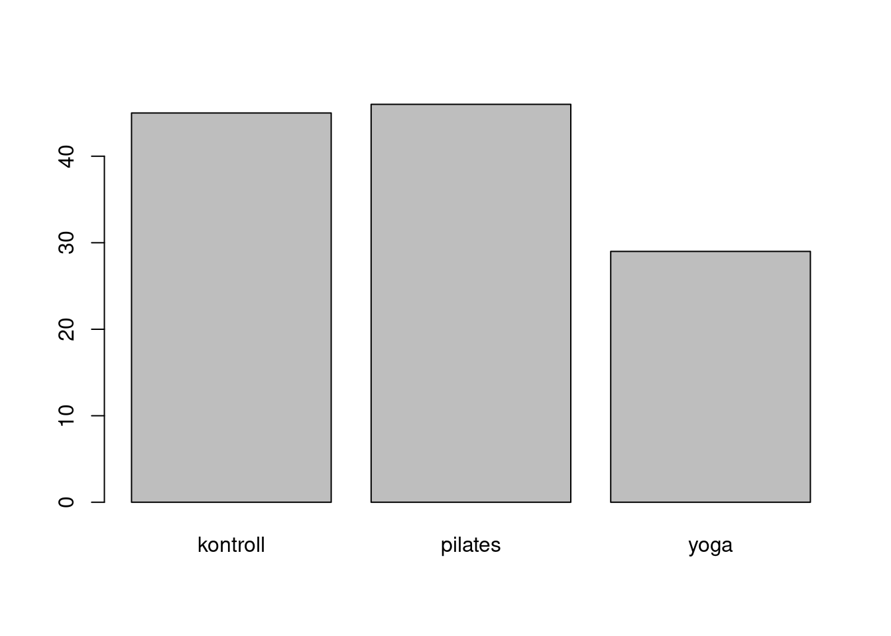
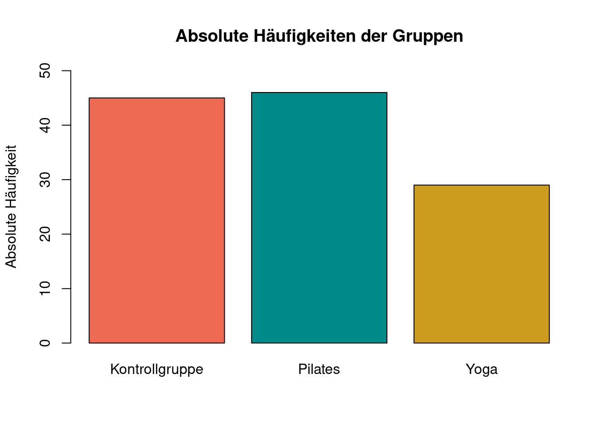
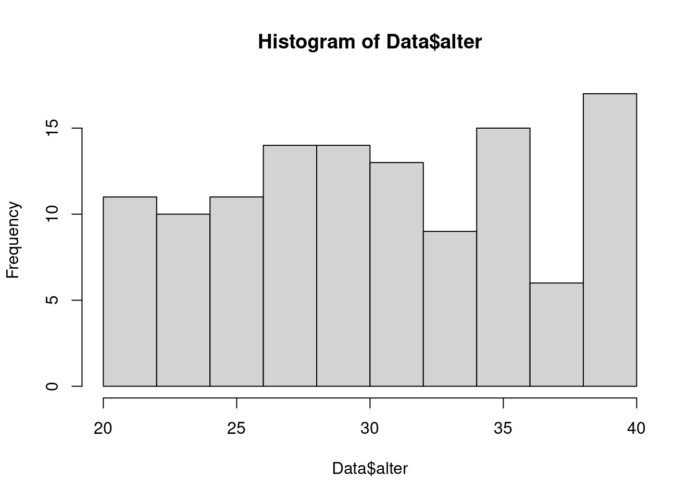
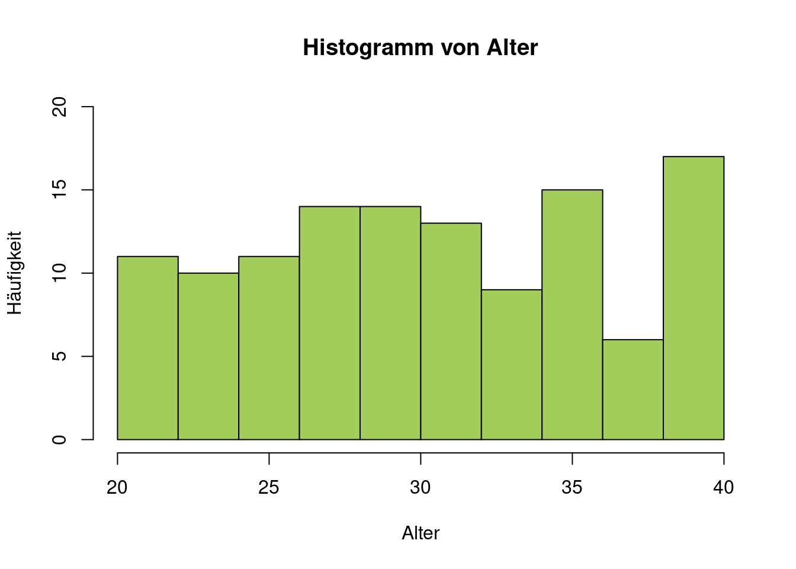
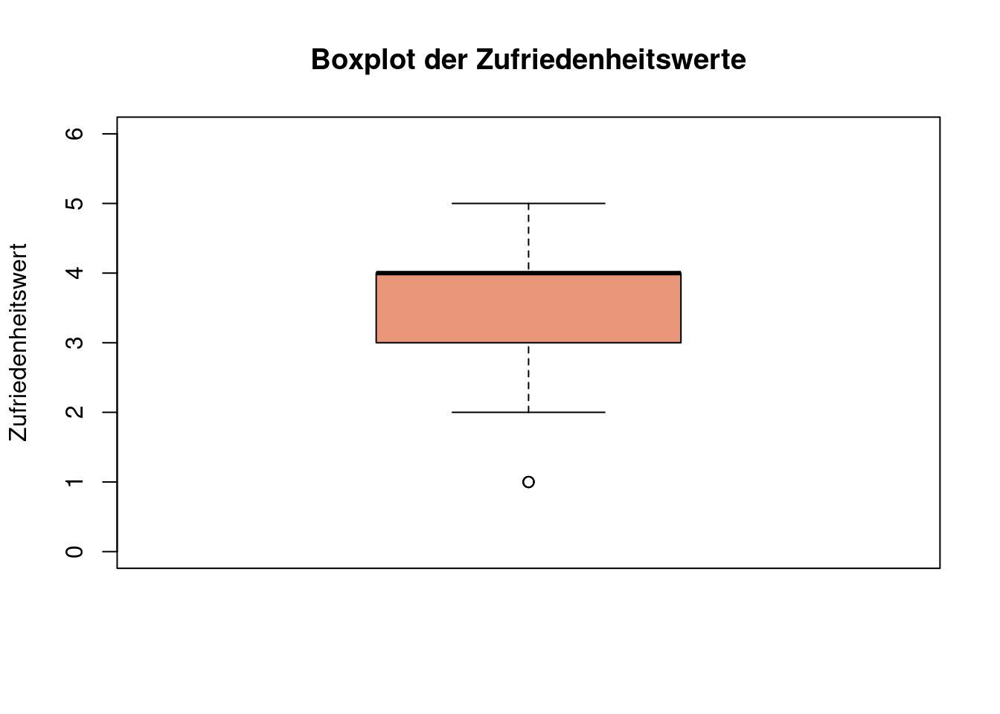
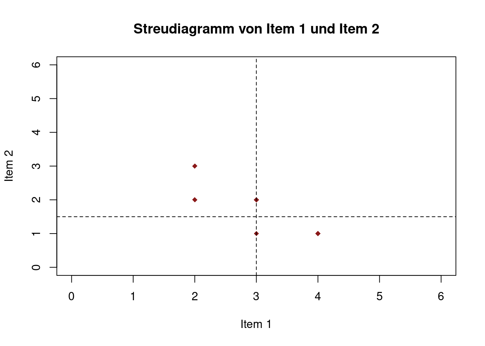
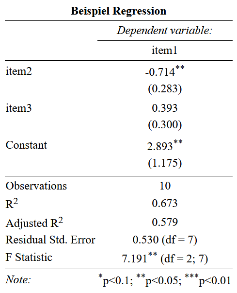

# Grafiken

## Grafiken für univariate Verteilungen

### Allgemeines

- R bietet flexible Gestaltungsmöglichkeiten für eine Reihe verschiedener Graphiken
- Komplexere Grafiken können mit dem Paket ggplot2 erstellt werden
- Generell gilt: Auf „Nutzerfreundlichkeit“ und Qualität der Grafiken achten (z.B. Legenden)

Fast alle Grafiken können mit folgenden Argumenten näher definiert werden:

- **main = "…"**: Überschrift
- **col = "…"**: Farbe(n); Mehrere Farben mit c("…", "…", …) eingeben
- **xlab = "…"** und **ylab = "…"**: Titel der x- bzw. y-Achse
- **xlim = c(…, …)** und **ylim = c(…, …)**: Achsenlimits 
…

#### Farben

Farben können als:

- Farbname ("red"), siehe die Datei Farben in R (im moodle-Kurs)    
- HEX-Code ("#FF8000FF"),
- oder RGB-Code ("229, 245, 249") 

eingetragen werden

### Darstellung von Häufigkeiten

Kreisdiagramme mit **pie()** erstellen 

- Datenformat: Variable in Häufigkeitstabelle (**table()**)

Balkendiagramme mit **barplot()** erstellen

- Datenformat: Variable in Häufigkeitstabelle (**table()**)


```r
tab <- table(Data$gruppe)
barplot(tab)
```



### Darstellung von Häufigkeiten

Mit einigen zusätzlichen Optionen:


```r
barplot(tab, 
        main = "Absolute Häufigkeiten der Gruppen", 
        col = c("coral2", "darkcyan", "goldenrod3"), 
        names.arg = c("Kontrollgruppe", "Pilates", "Yoga"), 
        ylab = "Absolute Häufigkeit", 
        ylim = c(0, 50))
```



### Darstellung von Verteilung

**hist(x, breaks, freq, …)** zeigt die Verteilung einer Variablen in einem **Histogramm**
\bigskip

**x**: Variable, für die das Histrogramm erzeugt werden soll (Wird mit dem **\$**-Operator ausgewählt)

**breaks**: Wie viele Balken sollen gebildet werden?

- Keine Angabe: Automatische Auswahl
- Einzelne Zahl n: Daten werden in n Balken geteilt
- Vektor: Balken werden zwischen den angegebenen Stellen gebildet 
  - z.B. **breaks = c(0,1,2,3)** &rarr; 3 Balken: 0 bis 1, 1 bis 2 und 2 bis 3
  - z.B. **breaks = seq(0,100,20)** &rarr; erstellt Werte im Schritt von 20 im Bereich zwischen 0 und 100 (5 Balken)

**freq**: Soll statt der absoluten die relative Häufigkeit geplottet werden? (**TRUE** = ja)


```r
hist(Data$alter)
```



Mit einigen zusätzlichen Optionen:


```r
hist(Data$alter, main = "Histogramm von Alter", 
     col = "darkolivegreen3", xlab = "Alter",
     ylab = "Häufigkeit", ylim = c(0, 20))
```



**boxplot(x, range =, …)** erstellt einen bzw. mehrere Boxplots

**x**: kann Vektor, Dataframe oder Formel sein

- Bei Eingabe eines Dataframes werden Boxplots für alle enthaltenen Variablen erzeugt
- Formeln ermöglichen Trennung nach Gruppen (s.u.)

**range**: Definiert die maximale Länge des Whiskers 

- Werte außerhalb werden als Ausreißer dargestellt
- z.B.: **range = 2** (2 * Interquatilabstand bzw. Boxlänge)
- default: **range = 1.5**


```r
boxplot(Data$zufri, 
        col = "darksalmon",
        main = "Boxplot der Zufriedenheitswerte",
        ylab = "Zufriedenheitswert",
        ylim = c(0, 6))
```



## Grafiken für bivariate Verteilungen

### Verteilung einer metrischen auf eine kategoriale Variable

Mithilfe von Boxplots lässt sich auch die Verteilung einer kategorialen Variable auf eine metrische Variable

**boxplot(A ~ B + C + …)** erzeugt Boxplots für alle möglichen Kombinationen von Faktorstufen getrennt

- **A**: metrische abhängige Variable
- **B,C**: kategoriale Variablen nach deren Ausprägungen aufgeschlüsselt wird 


```r
boxplot(Data$angst ~ Data$gruppe,
        col = "deeppink",
        main = "Boxplots der Angstwerte nach Gruppen getrennt",
        ylab = "Angstwerte",
        ylim = c(0, 6),
        names = c("Kontrollgruppe", "Pilates", "Yoga"))
```


### Verteilung zweier metrischer Variablen

Für zwei metrische Variablen wird meistens die Darstellungsform des **Streudiagramms** gewählt, was mit dem Befehl **plot(x,y,...)** erstellt werden kann

- **x**: Erste Variable ()
- **y**: Zweite Variable
- **...**: Weitere Graphikparameter (z.B. **pch**: Punkttyp $\rightarrow$ **?pch**)


```r
plot(Dataset$item1, Dataset$item2,
     ylab = "item1", xlab = "item2", 
     main = "Streudiagramm von Item 1 und Item 2", 
     xlim = c(0, 6), ylim = c(0, 6), pch = 18, col = "firebrick4")
```


Der Befehl **abline()** wird (separat) im Anschluss von **plot()** ausgeführt

Mit **abline(h = ..., v = ... , lwd = ..., lty = ...)** können horizontale (h) bzw. vertikale (v) Linien an beliebiger Position eingefügt werden

- **h**/**v**:Wert durch welchen die Linie verlaufen soll 
- **lwd**: legt die Stärke (Dicke) der Geraden fest (default = 1)
- **lty**: legt den Linientyp fest $\rightarrow$ **?par**


```r
plot(Dataset$item1, Dataset$item2,
     ylab = "Item 2", xlab = "Item 1", 
     main = "Streudiagramm von Item 1 und Item 2", 
     xlim = c(0, 6), ylim = c(0, 6), 
     pch = 18, 
     col = "firebrick4")
abline(h = mean(Dataset$item2), 
       v = mean(Dataset$item1), 
       col = "black", 
       lty = 2)

```




Mit **abline(fit)** wird die Regressionsgerade in das bestehende Streudiagramm eingezeichnet 

- **fit** entspricht dem definierten Modell, z.B. **fit = lm(item2 ~ item1)**


```r
model4 <-  item2 ~ item1
fit4 <-  lm(model4, Dataset)
plot(Dataset$item1, Dataset$item2, 
     ylab = "Item 2", xlab = "Item 1", 
     main = "Streudiagramm von Item 1 und Item 2",
	   sub = "Item 2 = 3.5000 - 0.6667 * Item 1", 
     xlim = c(0, 6), ylim = c(0, 6), 
     pch = 18, 
     col = "firebrick4")
abline(fit4, 
       lwd = 2, 
       col = "darkslategrey", 
       lty = 2)

```


## Tabellen 

### Mehrfelder Tabelle


```
   
    kontroll pilates yoga
  m       14      12    6
  w       31      34   23
```

**Korrelations Matrizen**

```
           item1      item2      item3
item1  1.0000000 -0.7698004  0.6123724
item2 -0.7698004  1.0000000 -0.4714045
item3  0.6123724 -0.4714045  1.0000000
```

### Formatierung

Das Package **stargazer** bietet den Befehl **stagazer(...,type = "html", title = "title", out = "...",)** 
  
  - **...**: einen Vektor, Matrix, Datensatz oder Modell
  - **type**: Welches Dateiformat soll der Befehl ausgeben. Beispielsweise **"html"**, **"latex"** oder **"text"**
  - **title**: Überschrift der Tabelle
  - **out**: Name der Datei. Abhängig von **type** entweder mit **.html**, **.tex** oder **.txt** am Ende. Wenn davor kein Dateipfad angegeben wird, wird die Datei im Projektordner gespeichert.

...noch viele weitere Möglichkeiten für Anpassungen. Siehe **?stargazer()**

**Anwendung an Beispielen**

Korrelationstabelle

```r
library(psych)
Dataset <- read.table("data/Daten.txt", header = TRUE)
Korrelationstabelle<- cor(Dataset[,2:4], method = "pearson")
Korrelationstabelle
           item1      item2      item3
item1  1.0000000 -0.7698004  0.6123724
item2 -0.7698004  1.0000000 -0.4714045
item3  0.6123724 -0.4714045  1.0000000
```

```r
library(stargazer)
stargazer(Korrelationstabelle,
          type = "html", 
          title = "Korellationstabelle", 
          out = "Korellationstabelle.html")
```

Aussehen in der html Datei:


Für Übertragung in Word einfach in der .html Dateien markieren, kopieren und in Word einfügen

Regressionsmodelle:


```r
fit1 <- lm(data = Dataset, formula = item1 ~ item2 + item3)
summary(fit1)

Call:
lm(formula = item1 ~ item2 + item3, data = Dataset)

Residuals:
     Min       1Q   Median       3Q      Max 
-0.75000 -0.33036 -0.08929  0.33036  0.64286 

Coefficients:
            Estimate Std. Error t value Pr(>|t|)  
(Intercept)   2.8929     1.1752   2.462   0.0434 *
item2        -0.7143     0.2832  -2.523   0.0397 *
item3         0.3929     0.3003   1.308   0.2322  
---
Signif. codes:  
0 '***' 0.001 '**' 0.01 '*' 0.05 '.' 0.1 ' ' 1

Residual standard error: 0.5297 on 7 degrees of freedom
Multiple R-squared:  0.6726,	Adjusted R-squared:  0.5791 
F-statistic: 7.191 on 2 and 7 DF,  p-value: 0.02008
```

### Tabellen und Modelle


```r
library(stargazer)
stargazer(fit1,
          type = "html", 
          title = "Beispiel Regression", 
          out = "Regression.html")
```



```r
library(stargazer)
stargazer(fit1,
          type = "html", 
          title = "Beispiel Regression", 
          out = "Regression.html",
          ci = TRUE,
          covariate.labels = c("sozioökonomischer status", 
                               "Alter","Konstante"),
          dep.var.labels = "Einkommen",
          dep.var.caption = "Abhängige Variable")
```

- **ci**: wenn **TRUE** ersetzt die angegebenen Standardfehler mit dem Konfifenzintervall für das Konfidenzniveau von 95 Prozent
- **covariate.labels**: ein Character-Vektor, der die Namen der unabhängigen Variablen ersetzt
- **dep.var.labels**: Name der abhängigen Variable
- **dep.var.caption**: Überschrift über die Abhängige Variable

**Resultat**


