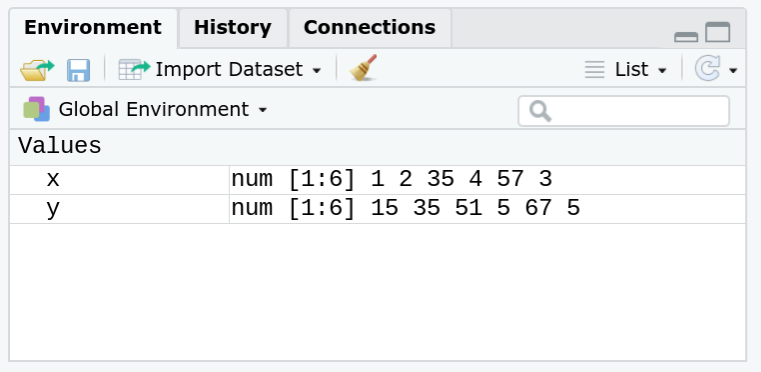
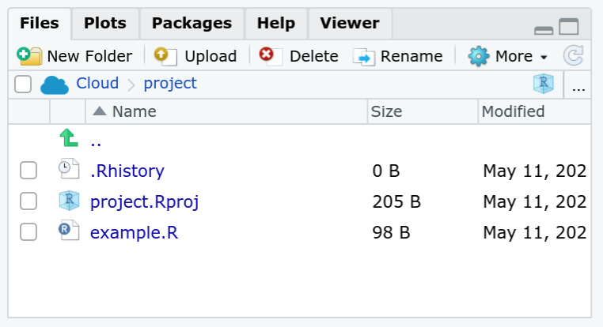

# Einführung in R und R Studio

Dieses Kapitel bietet einen Einführung in was R und RStudio eigentlich sind und wie deren Benutzeroberfläche aufgebaut ist.

## Was ist R?

- R ist eine freie Programmier**sprache**
- Sprache:
  - Vokabeln -> Begriffe für Objekte, Eigenschaften, Handlungen etc.
  - Grammatik -> Regeln, wie Vokabeln in Sinnzusammenhang gebracht werden

- Programmiersprache funktioniert analog:
  - Vokabeln -> Funktionen, Objekte
  - Grammatik -> Regeln für die Anwendung von Funktionen auf Objekte

- Wie können Sprachen  möglichst nachhaltig erlernt werden?
  - Starte bei den Basics
  - Basic Vokabeln
  - Basic Grammatik 

-> Ziel des Kurses ist es, die wesentliche Grammatik von R und die grundlegenden Vokabeln zu vermitteln.

## Sechs Gründe R zu lernen

1. *Open Source* und plattformübergreifend
2. Praktisch unbegrenzter Funktionsumfang
3. Entwickelt sich zum Standard in akademischer Welt und in der Wirtschaft
4. Publizierfähige Graphiken
5. Integration von Aufbereitung, Analyse und Präsentation
6. Internationale Community 

## Benutzeroberfläche von R und RStudio

### R GUI


- Haben wir dem Computer R durch Installation beigebracht, wird ein 
*Graphical User Interface* (GUI) mitinstalliert.
- Hier ist der volle Funktionsumfang bereits enthalten. 
- Die GUI ist leider wenig übersichtlich und wenig "komfortabel".

### RStudio

- RStudio bietet eine nutzer:innenfreundliche (und freie) Alternative für die Nutzung von R.
- Enthält
  - *Script*-Editor
  - Übersicht über *Objekte* in globaler Umgebung
  - Einfache Dateienhandhabung durch *Projekte*, u.v.m.
  


#### RStudio - Konsole


- Dient zur direkten Übergabe von Ausdrücken bzw. Funktionen an R
- Geeignet für kleine Tasks bzw. Tests
- Ergebnis wird direkt angezeigt
- Ergebnisse aus den Scripten, die keine Grafiken sind, werden hier angezeigt

#### RStudio - Script Editor


- Dient zur Eingabe von komplexen Funktionssequenzen (Scripts)
- Erlaubt das Speichern von Funktionssequenzen 


Der Editor öffnet sich nicht automatisch. Er muss händisch geöffnet werden über File -> New File -> R Script.


#### RStudio - Environment und Files



- Zeigt alle importierten Daten an
- Bietet Zugriff auf die *History*
- GitHub Zugriff, wenn angelegt



- Anzeige für *File Browser*
- Zeigt alle *Packages*, *Plots* etc.

#### Projekte in RStudio

*Vorteile:*  
- Keine definition des working directory nötig\
- Erleichtert Weitergabe unserer Projekte\
- Hilft unsere Arbeit zu organisieren  
- Ein neues Projekt erstellt ihr indem ihr in der oberen linken Ecke File -> New Project auswählt.


 
## Empfohlenes Vorgehen

In unseren Projekten arbeiten wir mit Skripten, dabei ist ein strukturiertes Vorgehen wichtig. Das bedeutet, das wir für **eine** Datenanalyse jeweils **ein** Skript erstellen. Dieses nachvollziehbar benennen und unseren Code mit Kommentaren versehen.


### Empfohlener Ablauf einer Analyse

1. Projekt und Skript(e) erstellen  
    -> siehe Modul 1  
2. Installieren bzw. laden aller nötigen Pakete  
    -> siehe Modul 2
3. Daten importieren  
    -> siehe Modul 3
4. Daten organisieren  
    -> siehe Modul 3 und 4
5. Daten analysieren  
    -> siehe Modul 5 und 6
6. Ergebnisse präsentieren  
    -> siehe Modul 7

### Beispiel Skript


``` r
# Packages installieren und laden
install.packages("tidyverse")
library(tidyverse)

# Daten laden
df_salary <- read.table(file = "Daten/Salary.txt")

# Daten organisieren
## Kategoriale Variable "salary_cat" erstellen (3 Kategorien)
df_salary_final <- mutate(df_salary,
                salary_cat = cut_number(salary, n = 3,
                                        labels = c("niedrig","mittel","hoch")))

# Daten analysieren
## Absolute Häufigkeiten Berufe in Gehaltskategorien(salary_cat)
table(df_salary_final$salary_cat, df_salary_final$profession)

# Daten präsentiern
## Mosaikplot für Berufe in Gehaltskategorien(salary_cat)
mosaicplot(table(df_salary_final$salary_cat, df_salary_final$profession),
           main = "Gehaltskategorie nach Beruf")
...

```


