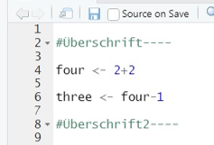
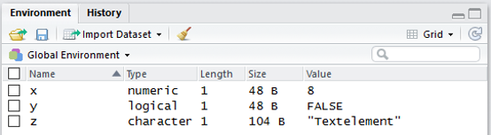

# Grundlagen

## Fundamentale Datentypen in R

In R existieren verschiedene atomare Datentypen aus welchen sich
wiederum komplexere Datentypen konstruieren lassen.

Datentyp           |  Beschreibung                       | Beispiel 
-------------------|-------------------------------------|----------
integer            |    ganze Zahlen                     |      -2       
numeric            |   reelle Zahlen                     |      5.2456   
logic              |   logische Werte                    |     TRUE     
character          |    Zeichenfolge                     |    "Mexico" 
NA,NULL,NaN        |   Unbestimmt, Leer, Undefiniert     |            
Inf                |    Unendlich                                        

Textelemente müssen immer in Anführungszeichen stehen, also entweder <font style="font-family:Times New Roman">"..."</font> oder <font style="font-family:monospace">'...'</font>

## R als Taschenrechner

### Dezimalstellen und Leerzeichen

- Dezimalzahlen werden in R mit einem Punkt und nicht mit einem Komma angegeben


```r
2,5
Error: <text>:1:2: unexpected ','
1: 2,
     ^
```

```r
2.5
[1] 2.5
```

- Die Anzahl von Leerzeichen zwischen Befehlsbestandteilen ist (mit Ausnahmen) egal

### Mathematische Operatoren

R- Befehl |Bedeutung
----------|-----------
+         |Addition
-         |Subtraktion
*         |Multiplikation
/         |Division
^         |Potenz
sqrt(x)   |Wurzel
log(x, base)  |Logarithmus

**Wichtig**: Klammersetzung und Punkt vor Strich

#### Beispiele


```r
3+2*8
[1] 19
```

```r
(2*10)/(2*2.5)
[1] 4
```

```r
sqrt(2)^2
[1] 2
```

```r
log(100000, base=10)
[1] 5
```

### Logische Operatoren

R Befehl |Bedeutung
---------|----------
==       |Gleich
>        |Größer
<        |Kleiner
>=       |Größer gleich
<=       |Kleiner gleich
!=       |Nicht-gleich
&        |logisches UND
\|        |logisches ODER

#### Beispiele


```r
4<5
[1] TRUE
```

```r
23!=24
[1] TRUE
```

```r
10<=4 | 12==6
[1] FALSE
```

```r
!("a"<"b" & TRUE==TRUE)
[1] FALSE
```

### Exkurs: Dokumentation

- Alles in einer Zeile nach # gilt als Kommentar und wird nicht in der Konsole ausgeführt
- Dabei gilt # = Überschrift, ## Unter-überschrift, ### Unter-unter-Überschrift usw.
- Überschrift $----$ ermöglicht eine Dropdownfunktion 



## Variablen und Objekte

### Abspeichern von Variablen

- Werte können in Variablen (Objekten) gespeichert werden


```r
x <- 5+3
```

- Objekte sind nach der Zuweisung mit ihrem Namen abrufbar


```r
x <- 5+3
x
[1] 8
```

### Abspeichern von Variablen

- Gespeicherte Objekte können weiterverwendet werden


```r
x <- 5
x + 10
[1] 15
```

```r
y <- 2*3
y+x
[1] 11
```

```r
z <- y+x
```

- Es können alle möglichen Elemente in Objekten gespeichert werden
  - Text:

```r
z <- "Textelement"
z
[1] "Textelement"
```
  - Vergleichsergebnisse

```r
y <- 5<4
y
[1] FALSE
```


### Hinweise zur Benennung**

- R unterscheidet Groß- und Kleinschreibung:
  - $\texttt{X}$ und $\texttt{x""}$ sind nicht das Gleiche
- Variablennamen dürfen nur Buchstaben, Zahlen, Unterstrich und Punkt enthalten
- Variablennamen sollten keine Leerzeichen enthalten
- Umlaute und ß wenn möglich vermeiden
- Variablennamen dürfen nicht mit einer Zahl oder einem Unterstrich beginnen

```r
7b <- 5+5
Error: <text>:1:2: unexpected symbol
1: 7b
     ^
```

### Enviroment



- Gespeicherte Objekte sind im Workspace (Environment) mit zusätzlichen Informationen aufgelistet
- Objekte können durch das Kästchen ausgewählt und durch das Besensymbol gelöscht werden

### Befehle für Zugriff auf Environment:


- **ls()** listet in der R-Konsole den Workspace auf
- Mit **rm("objektname1","objektname2")** werden Objekte entfernt
- Mit **rm(list = ls()** werden alle Objekte entfernt

## Funktionen

### Woraus besteht eine Funktion?

- R beinhaltet eine große Menge an Grundfunktionen
- Allgemeine Struktur: **Funktion(Argument1, Argument2, …)**
- Die Argumente definieren und spezifizieren die Funktion
- Beispiele für einfache Funktionen (hier nur ein Argument):
  - **sqrt(x)** berechnet Quadratwurzel 
  - **mean(X)** berechnet Mittelwert eines Vektors

#### Funktionen mit mehreren Argumenten

- **c(Argument1, Argument2, Argument3)}** definiert einen Vektor mit drei Werten (z.B. Spaltennamen)


```r
c(1,2,3,4,5)
[1] 1 2 3 4 5
```

```r
c("Hund","Katze","Maus")
[1] "Hund"  "Katze" "Maus" 
```

	  
- **round(x, digits = 2)}** rundet x auf 2 Nachkommastellen

```r
round(3.141593, digits = 2)
[1] 3.14
```

### Default-Werte in Funktionen

- Nicht alle Argumente von Funktionen müssen angegeben werden
- Diese optionalen Argumente nehmen dann default-Werte ein
- Beispielsweise bei $\texttt{round()}$ ist der Default-Wert $\texttt{digits = 0}$


```r
round(3.141593)
[1] 3
```

- default-Werte können in R Documentation nachgesehen werden (s. Help-Funktion)


- Die Argumente müssen nicht explizit benannt werden


```r
round(3.141593,2)
[1] 3.14
```

```r
round(2,3.141593)
[1] 2
```
- Dann ist aber die Reihenfolge wichtig, in der die Werte der Argumente eingegeben werden
- Benennen ist allerdings nachvollziehbarer (hilft, Fehler zu vermeiden)

### Exkurs: Help-Funktion

- Durch die Funktion $\texttt{help()}$ und $\texttt{?}$ lässt sich unter anderem herausfinden, welche Funktion welche Argumente benötigt


```r
help(round)
```

```r
?round
```


### Abspeichern von Output einer Funktionen**

- Die Ergebnisse von Funktionen können ebenfalls unter Objekten abgespeichert (und weiterverwendet) werden


```r
x <- c(1,2,3,4,5)
x
[1] 1 2 3 4 5
```

```r
r <- round(3.141593,2)
r+5
[1] 8.14
```

## Datenstrukturen

### Übersicht


### Vektoren

- eindimensionale Datenstruktur, in dem mehreren Elemente enthalten sind
- können im Enviroment als Objekt abgespeichert werden
- Mathematische und logische Operatoren können auf den Vektor (auf alle Elemente) angewandt werden


```r
x <- c(1,2,3,4,5)
x+1
[1] 2 3 4 5 6
```

```r
x>3
[1] FALSE FALSE FALSE  TRUE  TRUE
```

Durch eckige Klammern $\texttt{[]}$ können durch Angabe ihrer Position einzelne Elemente eines Vektors ausgewählt (indiziert) werden. 
(**Wichtig**: in R beginnt der Index immer mit 1)


```r
y <- c(110,120,130,140,150)
y
[1] 110 120 130 140 150
```

```r
y[3]
[1] 130
```

```r
y[c(1,3,5)]
[1] 110 130 150
```

Die Elemente können auch aufgrund von gewissen Bedingungen ausgewählt werden


```r
y <- c(110,120,130,140,150)
y
[1] 110 120 130 140 150
```

```r
y[y>=130]
[1] 130 140 150
```

```r
y[y==120]
[1] 120
```

Steht ein negatives Vorzeichen vor dem Index, so wird jedes Element außer dem indizierten aus dem Vektor ausgewählt


```r
x <- c(1,2,3,4,5)
x
[1] 1 2 3 4 5
```

```r
x[-3]
[1] 1 2 4 5
```

```r
x[c(-1,-3)]
[1] 2 4 5
```

Soll eine gewisse Reihe von angrenzenden Elementen (von Element i bis Element j) vektorisiert werden, werden die Indizes mit $\texttt{:}$ verbunden (also $\texttt{i:j}$)


```r
x <- c(1:5)
x
[1] 1 2 3 4 5
```

```r
x[1:3]
[1] 1 2 3
```

### Matrizen

- Zweidimensionale Datenstruktur
- Matrizen werden in R mit $\texttt{matrix(data = …, nrow = …, ncol = …, byrow = …)}$ erstellt
  - **data** ist ein Vektor, der die Elemente der Matrix enthält
  - **nrow** definiert die Anzahl der Zeilen der Matrix
  - **ncol** definiert die Anzahl der Spalten der Matrix
  - Wird die Matrix zeilenweise (**byrow = TRUE**) oder spaltenweise (**byrow = FALSE**) mit den Elementen befüllt?


```r
d <- c(1:9)
M <- matrix(data = d,nrow = 3,ncol = 3,byrow = TRUE)
M
     [,1] [,2] [,3]
[1,]    1    2    3
[2,]    4    5    6
[3,]    7    8    9
```

Die Auswahl von Matrixelementen ist analog zu der Auswahl von Elementen aus einem Vektor

- Allerdings wird bei einer Matrix ein Element durch zwei Positionen (Zeile und Spalte) definiert
  

```r
M
     [,1] [,2] [,3]
[1,]    1    2    3
[2,]    4    5    6
[3,]    7    8    9
```

```r
M[3,2]
[1] 8
```

- Sollen alle Spalten in einer bestimmten Zeile ausgewählt werden, bleibt der Spaltenindex leer
- Analog für die Auswahl aller Zeilen in einer bestimmten Spalte
- Negative Indizierung und Mehrfachauswahl auch möglich


```r
M
     [,1] [,2] [,3]
[1,]    1    2    3
[2,]    4    5    6
[3,]    7    8    9
```

```r
M[3,]
[1] 7 8 9
```

```r
M[,2]
[1] 2 5 8
```

### Dataframes

- Ein Dataframe ist eine Datenstruktur ähnlich zur Matrix 
- jede Spalte beinhaltet Werte einer Variable und jede Reihe Werte von jeder Variable (Spalten müssen gleichlang sein)
- Data Frames können mit **data.frame()}** aus mehreren (gleichlangen) Vektoren erstellt werden


```r
Alter <- c(16,17,15,22)
Geschlecht <- c("w","w","m","m")
Dataframe <- data.frame(Alter,Geschlecht)
Dataframe
  Alter Geschlecht
1    16          w
2    17          w
3    15          m
4    22          m
```

Verschieden Möglichkeiten für Elementauswahl

- Zeilen- und Spaltennummer (analog zu Matrizen)


```r
Dataframe[2,1]
[1] 17
```

- oder mithilfe des **\$}** operators direkt auf Variablen zugreifen


```r
Dataframe$Alter
[1] 16 17 15 22
```

```r
Dataframe$Alter[2]
[1] 17
```

- Mit dem **$** Operator können zudem einzelne Werte verändert werden


```r
Dataframe$Geschlecht[2] <- "m"
```

- ... oder ganze Variablen gelöscht werden


```r
Dataframe$Geschlecht <- NULL
```


** Um festzustellen, ob die Veränderungen funktioniert haben, muss nicht immer das Objekt extra in der Konsole aufgerufen werden. Es reicht im Enviroment zu schauen ob sich das Objekt entsprechend verändert hat.**

- Desweiteren können auch neue Variablen hinzugefügt werden


```r
Dataframe$Aktuelles_Jahr <- rep(2022,times=4)
```

- ...oder aus bestehenden Variablen gebildet werden


```r
Dataframe$Geburtsjahr <- Dataframe$Aktuelles_Jahr - Dataframe$Alter
Dataframe
  Alter Aktuelles_Jahr Geburtsjahr
1    16           2022        2006
2    17           2022        2005
3    15           2022        2007
4    22           2022        2000
```

## Packages

- R besteht aus einer Reihe von vorinstallierten Grundfunktionen
- Zusätzliche Funktionen erhält man durch externe Pakete (packages)
- Diese müssen heruntergeladen und eingebunden werden


### Installieren von Packages

- **library()}**: Auflistung aller bereits installierten Pakete
- **install.packages("NamedesPakets")}** (**!Hier unbedingt in Anführungszeichen**): Paket installieren (einmalig), Internetverbindung benötigt
- **library(NamedesPakets)}**: Laden eines Pakets (in jeder R-Sitzung nötig)
